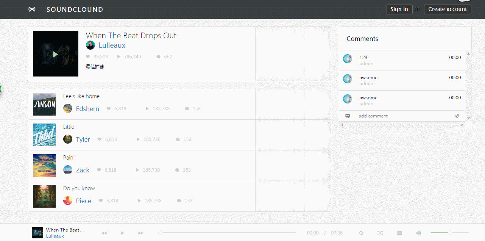
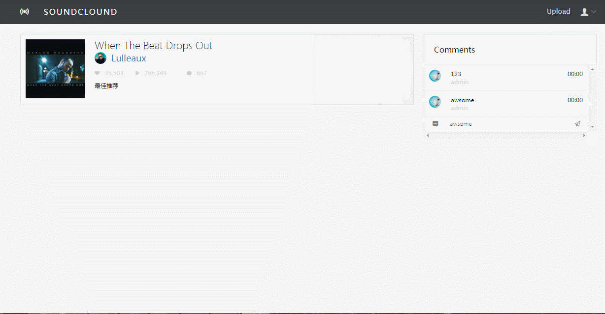

# Node-Music

> 基于Node, Express and MongoDB创建的RESTful API, 前端展示选用的Vue.

## Usage

About the server

```
1. npm install 

2. 需要开启MongoDB，在server文件夹的config.js配置自己数据库的Database.

3. npm run server

```
About the client

```
1. npm run dev

2. visit http://localhost:8080/

```

## Attention

这个项目实现了比较基础的登录、注册功能，但普通用户没有上传等权限，需要在数据库里将注册的指定用户的admin属性改为true即可。

音乐的上传涉及到一些图片，可以是线上图片地址，也可以将图片地址放到本地static文件下进行测试。

## Screenshot





## Further

目前这个项目基本流程已经完成，但一些细节仍需要优化。